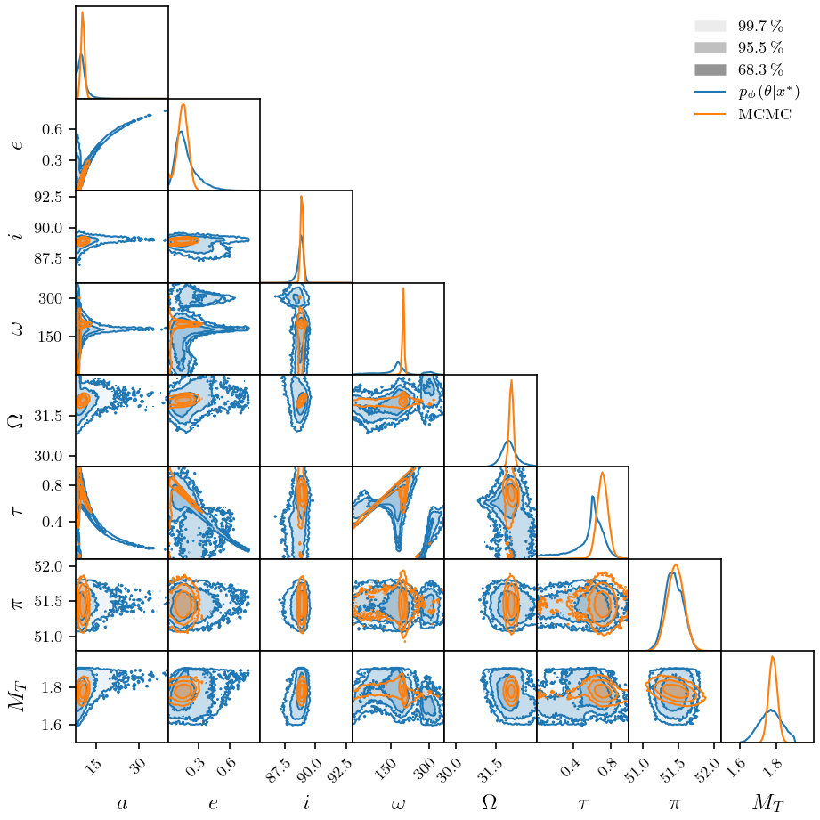
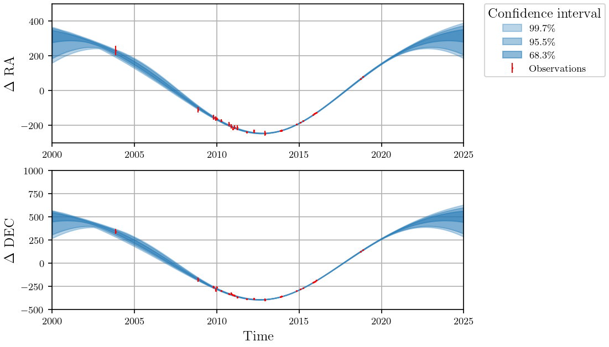
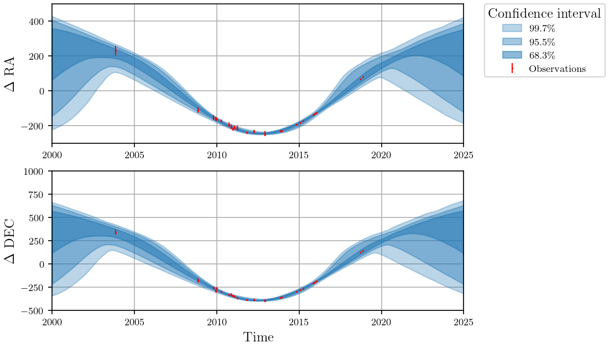

# NPE for $\beta$-pic b
Using Neural Posterior Estimator to retrieve the orbital parameters of the $\beta$-pictoris b planet given the direct imagery observations. 

---

## Dependencies
- orbitize
- lampe
- zuko
- h5py

---

## Generate Datasets

The script `generate.py` creates training, validation and test datasets in HDF5 format. These datasets are used to train the neural posterior estimator.

Here's how to run the script:

```
python generate.py --size [size] --name [name]
```

---

## MCMC

The script `mcmc.py` performs Markov Chain Monte Carlo (MCMC) to estimate the orbital parameters. Takes more than 24 hours

```
python mcmc.py
```

---

## Train the model 

```
python generate.py --size [size]
```

Should be the same size as was generated

---

## Results : 

The corner plot  obtained with the two methods. MCMC took around 27 hours to run and the Neural posterior
estimation model about 1h on a GTX 1080 Ti for a trainingset of size $2^{18}$. 
<p align="center">
    
</p>

We can also visualise the confidence interval produced by the two models with the real observations

### MCMC
<p align="center">
    
</p>

### NPE
<p align="center">
    
</p>
